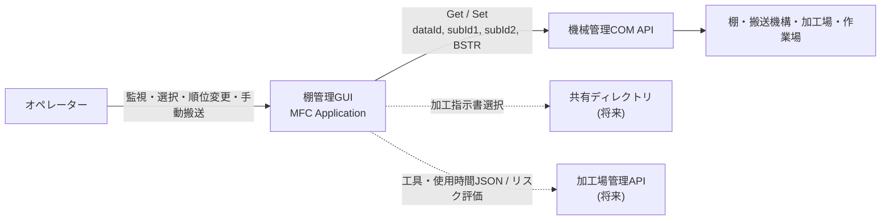
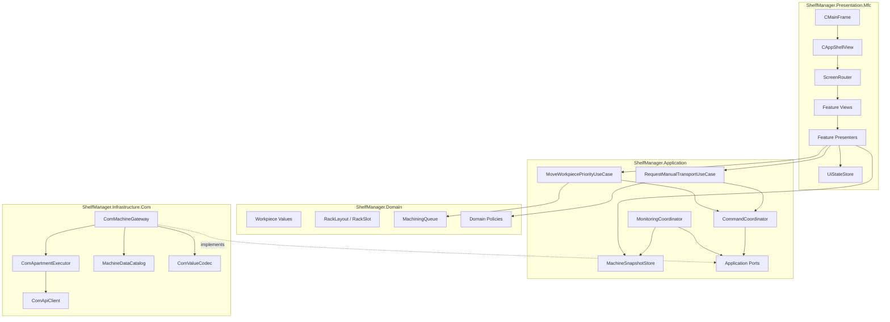
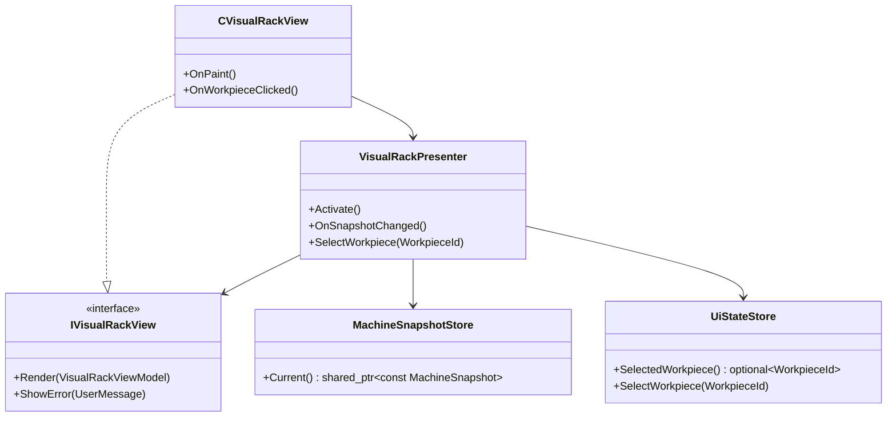
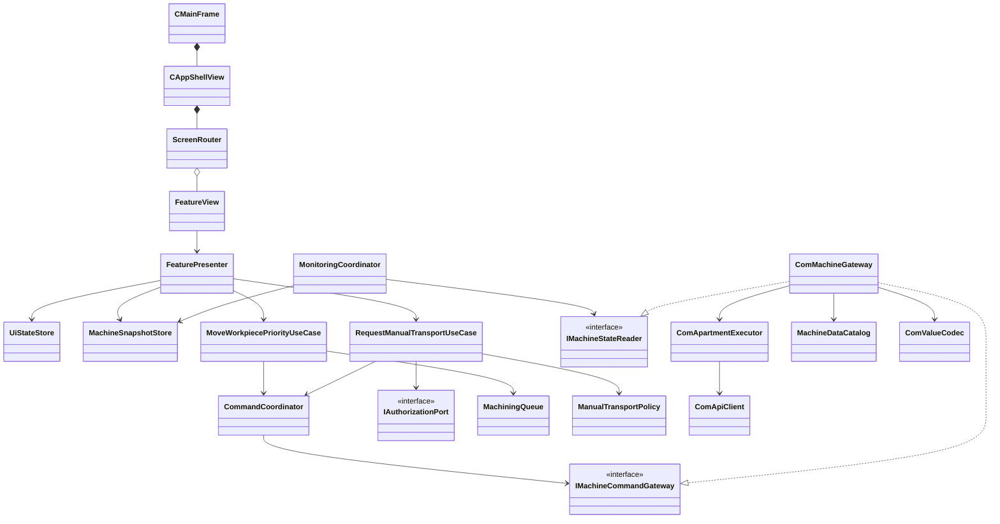
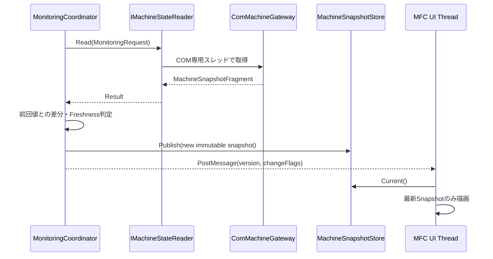
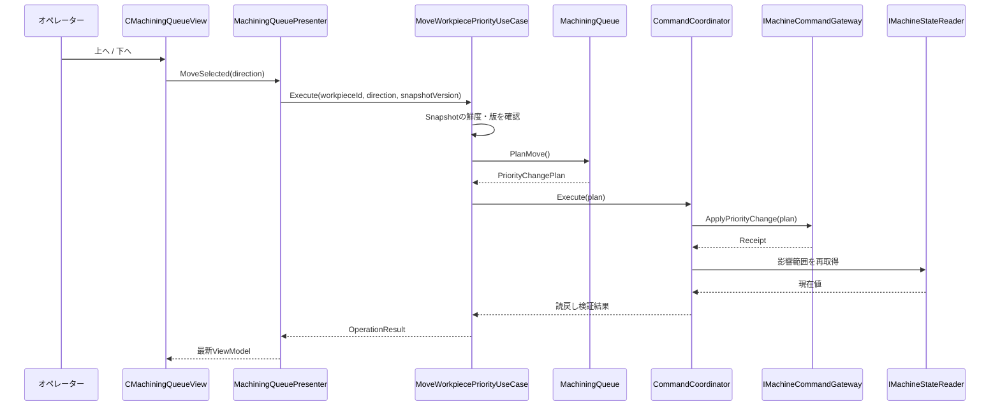
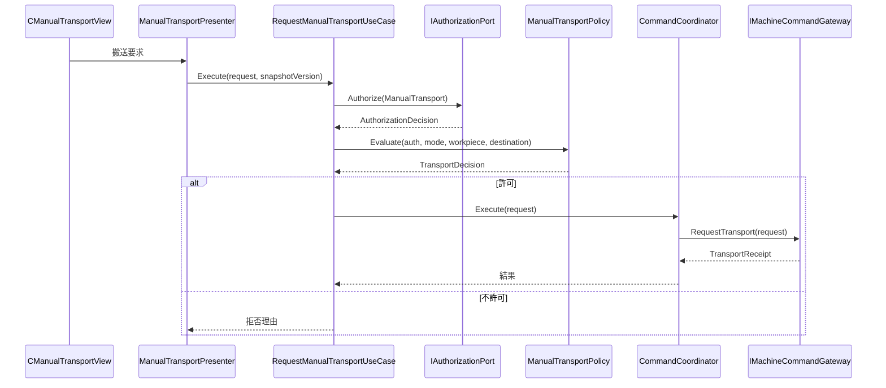

# 棚管理GUIアプリケーション アーキテクチャ・クラス設計書

| 項目 | 内容 |
|---|---|
| 文書状態 | レビュー対象 |
| 作成日 | 2026-07-23 |
| 対象リポジトリ | `katamor1/mfcapp` |
| 基準コミット | `67cc680e6ff159ba26c72873d9240b8e8aefe93c` |
| 対象フェーズ | MVP設計、および次ステップ以降の拡張境界 |
| 入力仕様 | `概略仕様書.md` |
| 採用方針 | MFC Presentation + Presenter + Application Use Case + Domain + Ports/Adapters によるモジュラーモノリス |

---

## 1. 文書の目的

本書は、棚に格納されたワークを遠隔監視・操作するWindows GUIアプリケーションについて、MVPから継続的に育成できるアーキテクチャ、クラス責務、実行モデル、品質管理方針を定義する。

対象アプリケーションは、次の情報を扱う。

- ワークの搬入先
- ワークID
- 加工順位
- ワークに紐付く加工指示書（最大10件）
- 加工指示書ごとの実行順番
- 加工待ち、加工中、加工完了、異常中断などのステータス
- 機械の動作状態、通信状態、エラー、ワーニング
- 認証オペレーターによる手動搬送操作

本書は画面実装の細部ではなく、画面数、処理数、データ数が増加しても責務を保てる構造を定める。特に、MFCの画面クラスへ業務判断、COMアクセス、状態管理を集中させないことを重視する。

---

## 2. 仕様から導出した要求

以下のIDは、本書内で追跡しやすくするために付与したものであり、入力仕様書に記載された正式な要求IDではない。

### 2.1 機能要求

| ID | 要求 |
|---|---|
| FR-01 | 物理棚を模した画面に、機種ごとの1～5段、各段3～13個の格納位置を表示する |
| FR-02 | ワークが存在する位置だけにアイコンを表示し、選択したワークのID、加工順位、最初の加工指示書名、ステータスを表示する |
| FR-03 | 加工順位順の表に、加工順位、ワークID、ステータスを表示する |
| FR-04 | 選択ワークの加工指示書を実行順番で表示し、機能ボタンで加工順位を上下できる |
| FR-05 | 自動スケジュール運転中でない場合に、認証オペレーターが格納先を指定して手動搬送できる |
| FR-06 | 左端の画面切替領域からビジュアル、加工順位、手動操作の各画面へ移動できる |
| FR-07 | 上端に機械状態、通信生存状態、エラー、ワーニングを常時表示する |
| FR-08 | COM APIから機種情報、ワーク情報などを取得し、加工順位変更などをCOM APIへ設定する |

### 2.2 非機能要求

| ID | 要求 |
|---|---|
| NFR-01 | 通常情報を15fps相当で監視し、変更時に画面を更新する |
| NFR-02 | 機械異常判断に必要な重要情報を60fps相当で監視し、変更時に画面を更新する |
| NFR-03 | ユーザー操作結果は200ms以内の反映を目標とする |
| NFR-04 | ユーザー操作が500ms以上継続する場合、操作中であることをモーダル表示する |
| NFR-05 | GUIは業務データの正本となる永続データを原則として持たない |
| NFR-06 | 画面・処理・データの責務を分離し、自動回帰テストを継続できる |
| NFR-07 | 人間によるレビューを前提として、依存関係、命名、コメント、変更理由を追跡できる |
| NFR-08 | 画面数、データ数、外部連携数の増加に対し、既存機能への影響を局所化する |

---

## 3. 設計目標と優先順位

設計上の優先順位を次の順序とする。

1. **安全性と状態整合性**  
   通信断、古いデータ、競合、重複操作によって誤搬送や誤った順位変更を行わない。
2. **応答性**  
   COMアクセスや解析処理でMFC UIスレッドを停止させない。
3. **テスト容易性**  
   実機やMFCウィンドウがなくても、ドメインルール、ユースケース、Presenterを自動テストできる。
4. **変更容易性**  
   画面、データ項目、共有ディレクトリ、JSON、HTTP APIなどの追加を局所化する。
5. **MVPとしての単純さ**  
   マイクロサービス、ローカル業務DB、汎用イベントバス、重量級DIコンテナを導入しない。

---

## 4. 採用アーキテクチャ

### 4.1 結論

MVPでは、単一Windowsプロセス内に次の層を持つ**モジュラーモノリス**を採用する。

```text
Presentation / MFC
        ↓
Application / Use Cases
        ↓
Domain

Infrastructure / COM・File・HTTP
        ↓ implements
Application Ports
```

MFCはUI技術としてのみ扱い、業務ルールや外部API仕様を持たせない。外部連携はApplication層が定義したPortをInfrastructure層が実装する。

### 4.2 採用理由

- 現段階は単一MFCアプリケーションであり、プロセス間通信を導入する必然性がない。
- COM APIの呼出しとMFC UIのスレッド責務を分離できる。
- 画面追加はPresentationのFeature追加として扱える。
- 将来の加工指示書解析やリスク評価を、Application PortとInfrastructure Adapterとして追加できる。
- 将来、自動順位調整をGUI停止中も継続する必要が生じた場合、MFC非依存のApplication/DomainをWindowsサービスへ移せる。

### 4.3 採用しない構成

#### MFC画面中心の直接実装

Viewから `comApiGet` / `comApiSet` を直接呼び、画面クラスに状態と業務判断を持たせる構成は採用しない。初期実装は短くても、画面追加、非同期化、再利用、テスト、通信異常処理が画面ごとに重複するためである。

#### 初期段階からのGUI＋Windowsサービス分割

MVPでは採用しない。配布、監視、IPC、バージョン整合、障害点が増えるためである。サービス分割に必要な境界だけを先に設ける。

#### ローカル業務データベース

採用しない。ワーク、加工順位、機械状態の正本は外部システムであり、GUI内DBとの二重管理を避ける。診断ログ、ユーザー設定、キャッシュは業務データの正本として扱わない。

---

## 5. システムコンテキスト



---

## 6. 論理アーキテクチャ



### 6.1 依存規則

依存は次の方向に限定する。

```text
Presentation → Application → Domain
Infrastructure → Application / Domain
Domain → 標準ライブラリ以外へ依存しない
```

禁止事項は次のとおり。

- Domain/Applicationから `CWnd`、`CString`、`BSTR`、MFCヘッダーを参照する。
- ViewまたはPresenterから生のCOM関数を呼ぶ。
- `dataId`、`subId1`、`subId2` を画面コードやユースケースへ直書きする。
- グローバルなCOMオブジェクト、サービスロケーター、変更可能な共有状態を置く。
- `CMainFrame` または単一Viewへ全画面・全処理を集約する。
- 外部APIのエラーコードや文字列表現をDomainへ漏らす。

---

## 7. Visual Studioソリューション構成

MVPでは、1つのEXEと複数の静的ライブラリ、テストプロジェクトで構成する。

```text
mfcapp.sln
├─ src/
│  ├─ ShelfManager.Domain/
│  ├─ ShelfManager.Application/
│  ├─ ShelfManager.Infrastructure.Com/
│  └─ ShelfManager.Presentation.Mfc/
├─ tests/
│  ├─ ShelfManager.Domain.Tests/
│  ├─ ShelfManager.Application.Tests/
│  ├─ ShelfManager.Infrastructure.Com.Tests/
│  └─ ShelfManager.Presentation.SmokeTests/
└─ docs/
   ├─ superpowers/specs/
   └─ architecture/decisions/
```

初期リポジトリの `mfcapp` プロジェクトは、段階的に `ShelfManager.Presentation.Mfc` の役割へ移行する。最初からファイルを大規模移動するのではなく、層ごとのプロジェクトを追加し、既存MFCエントリーポイントをComposition Rootとして整理する。

### 7.1 Feature単位のPresentation構成

```text
ShelfManager.Presentation.Mfc/
├─ Bootstrap/
│  └─ AppCompositionRoot
├─ Shell/
│  ├─ CMainFrame
│  ├─ CAppShellView
│  └─ ScreenRouter
├─ Shared/
│  ├─ UiStateStore
│  ├─ OperationOverlay
│  └─ ViewFormatting
└─ Features/
   ├─ VisualRack/
   ├─ MachiningQueue/
   ├─ ManualTransport/
   └─ MachineStatus/
```

画面追加は `Features/<FeatureName>` の追加として行う。各Featureは原則として `View`、`Presenter`、`ViewModel` を持つ。

### 7.2 Composition Root

`AppCompositionRoot` はアプリケーション起動時に依存関係を組み立てる唯一の場所とする。

責務:

- Clock、Logger、Authorization Port、COM Adapterの生成
- `MachineSnapshotStore`、`CommandCoordinator`、Use Caseの生成
- PresenterとViewの関連付け
- `MonitoringCoordinator` の開始・停止
- 終了時の受付停止、監視停止、COM Executor停止の順序制御

MVPでは重量級DIコンテナを導入せず、明示的なコンストラクタ注入で結線する。現在の雛形にある `CChildView` は万能Viewへ成長させず、`CAppShellView` へ置換または役割を限定して移行する。

---

## 8. Presentation設計

### 8.1 Shell

#### `CMainFrame`

責務:

- トップレベルウィンドウの生成と破棄
- `CAppShellView` の配置
- アプリケーション終了要求の調停
- MFCコマンドルーティングの最小限の中継

持たない責務:

- COMアクセス
- ワーク状態の保持
- 加工順位変更ロジック
- 手動搬送可否の判定
- 個別画面の描画ロジック

#### `CAppShellView`

画面を次の領域へ分割する。

```text
┌─────────────────────────────────────────┐
│ MachineStatusStrip                      │
├──────────┬──────────────────────────────┤
│          │                              │
│ NavRail  │ ActiveFeatureView            │
│          │                              │
└──────────┴──────────────────────────────┘
```

責務:

- 上部の機械状態領域の配置
- 左側の画面切替領域の配置
- 中央画面ホストの配置
- ウィンドウサイズ変更時のレイアウト
- 操作中オーバーレイの表示

#### `ScreenRouter`

責務:

- `ScreenId` とFeature Viewの対応付け
- 初回表示時の遅延生成
- 画面切替
- 画面ライフサイクル通知
- 選択中画面の保持

画面数増加に備え、`switch` 文を複数箇所へ分散させず、登録表を一元化する。

### 8.2 MVPパターン

各画面は、MFC Viewと通常C++クラスのPresenterに分離する。



Viewは次だけを行う。

- ユーザー入力をPresenterへ通知する。
- Presenterから受け取ったViewModelを描画する。
- MFC固有のフォーカス、レイアウト、アクセシビリティを扱う。

Presenterは次を行う。

- SnapshotとUI状態からViewModelを作る。
- ユースケースを呼び出す。
- 処理中、成功、失敗を表示状態へ変換する。
- MFC型を使用しない。

### 8.3 画面別クラス

| Feature | View | Presenter | 主なViewModel |
|---|---|---|---|
| ビジュアル棚 | `CVisualRackView` | `VisualRackPresenter` | `VisualRackViewModel` |
| ワーク概要 | `CWorkpieceSummaryPane` | `WorkpieceSummaryPresenter` | `WorkpieceSummaryViewModel` |
| 加工順位 | `CMachiningQueueView` | `MachiningQueuePresenter` | `MachiningQueueViewModel` |
| 指示書一覧 | `CInstructionSequencePane` | `InstructionSequencePresenter` | `InstructionSequenceViewModel` |
| 手動操作 | `CManualTransportView` | `ManualTransportPresenter` | `ManualTransportViewModel` |
| 機械状態 | `CMachineStatusView` | `MachineStatusPresenter` | `MachineStatusViewModel` |

`CMachineStatusView` は常時表示するが、入力フォーカスを取得しない。エラー／ワーニングの詳細表示を開く操作が必要になった場合も、状態帯そのものではなく明示的な詳細ボタンまたは通知領域へ操作対象を分離する。

右側のサブ画面は、用途別のPaneとして分割する。選択画面に応じて表示内容を切り替える巨大な万能詳細クラスは作らない。

---

## 9. Application設計

Application層は、ユーザーまたは監視スケジューラーから見た操作単位を表す。業務ルールはDomainへ委譲し、外部アクセスはPortを介して行う。

### 9.1 主要クラス

| クラス | 責務 |
|---|---|
| `MonitoringCoordinator` | 監視周期、対象グループ、取得結果、Snapshot公開を調停する |
| `MonitoringPlanBuilder` | Critical、Standard、OnDemandの監視計画を作る |
| `MachineSnapshotAssembler` | 部分取得結果を整合したイミュータブルSnapshotへまとめる |
| `MachineSnapshotStore` | 最新Snapshotをスレッド安全に公開する |
| `MoveWorkpiecePriorityUseCase` | 加工順位移動の検証、計画、実行、読戻し確認を行う |
| `RequestManualTransportUseCase` | 認証、機械モード、搬送条件を検証し、搬送要求を実行する |
| `CommandCoordinator` | 変更系コマンドを直列化し、監視より高い優先度で実行する |
| `OperationStateStore` | ユーザー操作の開始時刻、処理中、成功、失敗を保持する |
| `UserMessageMapper` | 技術エラーをユーザー向けメッセージへ変換する |

### 9.2 Application Port

```cpp
class IMachineStateReader {
public:
    virtual ~IMachineStateReader() = default;

    virtual Result<MachineSnapshotFragment> Read(
        const MonitoringRequest& request) = 0;
};

class IMachineCommandGateway {
public:
    virtual ~IMachineCommandGateway() = default;

    virtual Result<PriorityChangeReceipt> ApplyPriorityChange(
        const PriorityChangePlan& plan) = 0;

    virtual Result<TransportReceipt> RequestTransport(
        const TransportRequest& request) = 0;
};

class IAuthorizationPort {
public:
    virtual ~IAuthorizationPort() = default;

    virtual AuthorizationDecision Authorize(
        OperatorAction action) = 0;
};

class IClock {
public:
    virtual ~IClock() = default;
    virtual TimePoint Now() const = 0;
};
```

`Result<T>` はプロジェクト共通の成功・失敗型とする。具体的な実装は採用するC++言語レベルに合わせるが、例外のみで外部通信エラーを表現しない。

### 9.3 主要クラス関係



---

## 10. Domain設計

### 10.1 基本方針

GUIは業務データの正本ではないため、長寿命で自由に変更可能な巨大 `Workpiece` オブジェクトを中心にしない。外部状態を表すイミュータブルなSnapshotと、純粋なルールを持つ値オブジェクト／ポリシーを中心にする。

### 10.2 主要な型

```cpp
class WorkpieceId;
class QueuePriority;
class InstructionOrder;
class RackLevel;
class RackPosition;

struct RackSlot;
struct WorkpieceLocation;
struct MachiningInstructionRef;
struct WorkpieceSummary;
struct WorkpieceDetails;
struct RackLayout;
struct RackState;
struct MachineHealth;
struct DataFreshness;
struct MachineSnapshot;
```

### 10.3 状態型

```cpp
enum class WorkpieceStatus {
    WaitingForMachining,
    Machining,
    Completed,
    InterruptedAbnormally,
    InTransport,
    Unknown
};

enum class MachineConnectionState {
    Connected,
    Degraded,
    Disconnected,
    Unknown
};

enum class DataFreshnessState {
    Fresh,
    Stale,
    Unavailable
};
```

入力仕様にない状態コードを推測して既存状態へ丸めない。未知の値は `Unknown` とし、診断ログへ元値を残す。

### 10.4 Snapshot

```cpp
struct WorkpieceSummary {
    WorkpieceId id;
    WorkpieceLocation location;
    QueuePriority priority;
    WorkpieceStatus status;
    std::optional<MachiningInstructionName> firstInstruction;
};

struct MachineSnapshot {
    SnapshotVersion version;
    TimePoint capturedAt;
    MachineHealth health;
    RackLayout rackLayout;
    RackState rackState;
    std::vector<WorkpieceSummary> workpieces;
    DataFreshness freshness;
};
```

Snapshotは公開後に変更しない。`MachineSnapshotStore` は `shared_ptr<const MachineSnapshot>` 相当をアトミックに差し替える。Presenterは同一Snapshot内で整合した値を参照する。

### 10.5 棚レイアウト

- 棚段数を固定長配列で表現しない。
- 1～5段、各段3～13位置を機種情報から動的に構築する。
- 仕様範囲外の構成を受けても配列外アクセスしない。
- 仕様範囲外の場合は「未対応構成」として安全側に表示し、変更操作を無効化する。

### 10.6 加工指示書

- 1ワークあたり最大10件の制約をDomainで検証する。
- 指示書の表示順と実行順を区別する。
- 同一実行順を許可するかは入力仕様に定義がないため、初期実装では重複を不正データとして表示し、変更操作を抑止する。
- 指示書詳細は選択ワークに対するOnDemand取得とし、全ワーク分を常時取得しない。

### 10.7 加工順位

`MachiningQueue` は現在の順位一覧から移動計画を生成する純粋オブジェクトとする。

```cpp
class MachiningQueue {
public:
    Result<PriorityChangePlan> PlanMove(
        WorkpieceId target,
        MoveDirection direction) const;
};
```

ルール:

- 最上位の上移動、最下位の下移動は変更なしとして扱う。
- 対象ワークが現在一覧に存在しない場合は競合とする。
- 順位が重複または欠落し、入替規則を一意に決められない場合は書込みを行わない。
- 変更計画には、対象ワークだけでなく影響する全ワークの期待旧値と新値を含める。
- 書込み後は対象値を再取得して検証する。

### 10.8 手動搬送ポリシー

```cpp
class ManualTransportPolicy {
public:
    TransportDecision Evaluate(
        const OperatorAuthorization& authorization,
        const MachineMode& mode,
        const WorkpieceSummary& workpiece,
        const TransportDestination& destination) const;
};
```

最低条件:

- 認証オペレーターである。
- 自動スケジュール運転中ではない。
- 通信が正常で、必要データがFreshである。
- 対象ワークと搬送先が存在する。
- 対象ワークが搬送可能状態である。
- 搬送先が利用可能である。
- 同一ワークに対する別コマンドが処理中でない。

認証方式と搬送可能状態の正式な定義は入力仕様にない。初期方針は、認証結果または機械状態を確認できない場合に操作を許可しないFail Closedとする。

---

## 11. Infrastructure / COM設計

### 11.1 構成

```text
Application Port
    ↑ implements
ComMachineGateway
    ├─ ComApartmentExecutor
    ├─ ComApiClient
    ├─ MachineDataCatalog
    ├─ ComValueCodec
    └─ MachineAccessErrorMapper
```

### 11.2 `ComApiClient`

生の `comApiGet` / `comApiSet` を包む最薄のRAIIラッパーとする。

責務:

- BSTRの確保・解放
- API戻り値の保持
- COMオブジェクト寿命の管理
- 生API呼出しの単一箇所化

持たない責務:

- dataIdの意味解釈
- ワーク状態への変換
- 再試行方針
- UIメッセージ生成

### 11.3 `ComApartmentExecutor`

COM APIのスレッドモデルは入力仕様に記載がない。初期実装は最も保守的な構成として、専用STAスレッドに全COM呼出しを閉じ込める。

責務:

- 専用スレッド上でのCOM初期化・終了
- 読取・書込ジョブのキュー管理
- コマンドと監視の優先度制御
- シャットダウン時の受付停止と安全な終了
- COM呼出し所要時間の計測

COMベンダー仕様でMTAまたは並列呼出しが明示された場合も、Application側を変更せずExecutor実装を差し替えられる構造とする。

### 11.4 `MachineDataCatalog`

`dataId` とサブIDの意味を一元管理する。

各項目は最低限次を持つ。

| 属性 | 内容 |
|---|---|
| 論理名 | 例: `WorkpieceInstructionOrder` |
| dataId | COM APIへ渡すデータ種類ID |
| subId1 | 意味、範囲、未使用時の値 |
| subId2 | 意味、範囲、未使用時の値 |
| Access | Read / Write / ReadWrite |
| ValueType | Integer / Boolean / Enum / Stringなど |
| MonitoringClass | Critical / Standard / OnDemand |
| Validation | 範囲、最大長、許容値 |
| Source | ベンダーAPI仕様上の参照箇所 |

画面、Presenter、Use Caseに数値IDを直書きしない。

### 11.5 `ComValueCodec`

責務:

- BSTRからUTF-16文字列への安全な変換
- 数値、真偽値、列挙値の厳密な解析
- 前後空白、空文字、不正文字、範囲外の検出
- 書込値のシリアライズ
- 解析失敗時の元文字列を含む診断情報生成

不正値を0や空文字へ暗黙変換しない。

### 11.6 エラー分類

```cpp
enum class MachineAccessErrorCode {
    CommunicationUnavailable,
    Timeout,
    InvalidResponse,
    UnsupportedData,
    PermissionDenied,
    Busy,
    Conflict,
    OperationRejected,
    InternalFailure
};
```

技術詳細はログへ残し、Presentationには `UserMessageMapper` を介して操作可能な説明を渡す。

---

## 12. 監視・スレッド・更新モデル

### 12.1 スレッド構成

```text
MFC UI Thread
  - 入力、描画、レイアウト
  - Snapshot更新通知の受信
  - COMを呼ばない

Monitoring Scheduler
  - 監視期限の計算
  - MonitoringRequestの投入
  - UIを直接操作しない

COM Apartment Thread
  - COM初期化
  - comApiGet / comApiSet
  - 読取・書込の直列実行

将来のWorker Pool
  - 指示書解析、JSON生成、HTTP処理
  - MVPでは未作成
```

### 12.2 監視クラス

| クラス | 目標周期 | 対象例 |
|---|---:|---|
| Critical | 約16.7ms | 通信生存、機械異常、手動搬送判断に必要な状態 |
| Standard | 約66.7ms | 棚状態、ワーク一覧、加工順位 |
| OnDemand | 選択・画面表示時 | 選択ワークの全指示書、詳細情報 |

入力仕様の15fps/60fpsは、該当情報を監視する目標周期として扱う。すべてのデータを60fpsで総取得することは要求しない。

### 12.3 スケジューリング規則

- ユーザー操作コマンドは通常監視より高い優先度で実行する。
- 同じ監視グループのジョブが未完了なら、古い周期ジョブを積み増さない。
- 遅延時は過去の全周期を再生せず、最新要求を優先する。
- 読取失敗に同期的な多重再試行を行わず、次周期で再取得する。
- 非冪等な変更コマンドは、API仕様で安全が保証されない限り自動再試行しない。
- UI更新は値の変更時、Freshness変化時、または操作結果確定時に行う。

### 12.4 Snapshot公開



UI通知はlatest-winsとする。UIが一時的に遅延しても、古いSnapshotを順番に描画するキューを作らない。

---

## 13. ユーザー操作モデル

### 13.1 操作状態

```cpp
enum class OperationPhase {
    Idle,
    Running,
    Succeeded,
    Failed
};
```

`OperationStateStore` は操作ID、対象、開始時刻、Phase、結果を保持する。

- 200ms以内の完了を目標とする。
- 500ms経過時に操作中オーバーレイを表示する。
- オーバーレイはMFCメッセージポンプを停止する `DoModal` 依存ではなく、Shell内で再入操作を抑止するモーダル相当のオーバーレイとする。
- 完了または失敗時に必ず解除する。
- アプリ終了中は新規操作を受け付けない。

### 13.2 加工順位変更



規則:

- 画面だけを先に成功状態へ変更する楽観表示は行わない。
- Snapshotが古い、対象が消えた、期待旧値が変わった場合は競合とし、再取得後に再操作を促す。
- 複数値の書換えが必要な場合は、Gateway内で順序と補償可否を管理する。
- APIにトランザクションがない場合、途中失敗時は再読取し、実状態を表示する。安全性が保証できない自動補償は行わない。

### 13.3 手動搬送



手動搬送は安全側に倒す。通信断、Stale、認証不明、自動運転状態不明、搬送先状態不明の場合は実行しない。

---

## 14. データ鮮度と通信異常

### 14.1 起動時

- 初回Critical/Standard Snapshotが揃うまで、変更操作を無効化する。
- 起動直後の未取得値を0、空文字、正常として表示しない。
- 機械状態領域に「同期中」を表示する。

### 14.2 通信断

- 最終正常値を保持して表示してよいが、取得時刻とStale表示を付ける。
- 変更操作を無効化する。
- 通信断と機械異常を別の状態として表示する。
- 復旧時は全Standardデータを再同期し、差分だけでなく整合性を再構築する。

### 14.3 Freshness

各Snapshotまたは重要Fragmentに以下を持たせる。

```cpp
struct DataFreshness {
    DataFreshnessState state;
    TimePoint lastSuccessfulRead;
    std::optional<MachineAccessErrorCode> lastError;
};
```

古い値を新しい値として扱わない。

---

## 15. 将来機能への拡張設計

将来機能はMVPに実装しないが、以下の境界を壊さず追加できる構成とする。

### 15.1 ワーク詳細画面

追加候補:

```text
GetWorkpieceDetailsQuery
WorkpieceDetailsPresenter
CWorkpieceDetailsView
WorkpieceDetailsViewModel
```

選択ワークの詳細はOnDemandで取得する。常時全ワークの詳細を監視しない。

### 15.2 加工場・作業場の詳細／進捗画面

`WorkpieceLocation` を棚位置だけの数値にしない。

```cpp
using WorkpieceLocation = std::variant<
    RackSlot,
    SetupStationLocation,
    MachiningStationLocation,
    InTransportLocation,
    UnknownLocation>;
```

これにより、棚外ワークを例外扱いせず、同一IDで所在と進捗を表示できる。

### 15.3 共有ディレクトリからの加工指示書選択

Application Port:

```cpp
class IInstructionRepository {
public:
    virtual Result<std::vector<InstructionFileInfo>> List(
        const InstructionSearchCondition& condition) = 0;

    virtual Result<InstructionDocument> Load(
        const InstructionFileId& id) = 0;
};
```

Infrastructure Adapter:

```text
SharedDirectoryInstructionRepository
```

UNCパス、ファイル列挙、アクセス権、ファイル変更検知をInfrastructureへ閉じ込める。ViewからWindowsファイルAPIを直接呼ばない。

### 15.4 加工指示書の走査と工具使用一覧JSON

```text
InstructionDocument
    ↓ IInstructionParser
ToolUsagePlan
    ↓ IToolUsagePlanSerializer
JSON
```

主要型:

```cpp
struct ToolRequirement {
    ToolId toolId;
    Duration expectedUsage;
};

struct ToolUsagePlan {
    WorkpieceId workpieceId;
    std::vector<ToolRequirement> requirements;
};
```

ParserがJSON文字列を直接生成しない。解析結果とシリアライズを分離し、JSON形式変更や別APIへの転用を可能にする。

### 15.5 異常中断リスク評価と自動順位調整

```text
ToolUsagePlan
    ↓ IRiskAssessmentClient
InterruptionRiskAssessment
    ↓ RiskAdjustedOrderingPolicy
PriorityAdjustmentPlan
    ↓ ApplyPriorityAdjustmentUseCase
IMachineCommandGateway
```

候補クラス:

```text
IRiskAssessmentClient
EvaluateInterruptionRiskUseCase
InterruptionRiskAssessment
RiskAdjustedOrderingPolicy
ApplyPriorityAdjustmentUseCase
```

優先度概念を次のように分離する。

```text
BasePriority
  人間または上位システムが設定した順位

PriorityAdjustment
  リスク評価などによる補正値、理由、評価時刻

EffectiveOrder
  実際に適用する加工順
```

リスクAPIクライアントが直接COMへ書き込んではならない。評価、ポリシー、変更計画、書込みを分離する。

#### 永続化に関する方針

MVPのGUIは業務データを永続化しない。将来自動調整の理由や評価結果を再起動後も保持する必要がある場合、その正本は次のいずれかに置く。

1. 加工場管理システムが提供するAPI
2. 機械管理側の拡張データ
3. GUIから独立したOrchestrator Serviceの永続ストア

GUIメモリだけを自動調整の正本にはしない。

#### サービス分割条件

次のいずれかが必要になった時点で、自動処理をWindowsサービスへ分離する。

- GUIが閉じていても自動評価・順位調整を継続する。
- 複数GUIから同一状態を共有する。
- 評価履歴と操作監査を常時保存する。
- API再試行、キュー、障害復旧をGUIライフサイクルから独立させる。

Application/DomainをMFC非依存にすることで、この分離時の再利用を可能にする。

---

## 16. エラー処理とログ

### 16.1 エラー処理原則

- 失敗を空値、0、正常値へ変換しない。
- 画面表示用メッセージと診断情報を分離する。
- エラーを画面ごとに個別解釈せず、共通分類を使う。
- 変更系処理では相関IDを採番する。
- 非冪等処理を暗黙再試行しない。
- 例外はプログラム不変条件違反または回復不能な内部失敗に限定し、外部通信の通常失敗は `Result` で表す。

### 16.2 構造化ログ

最低限次を記録する。

```text
timestamp
severity
eventName
correlationId
operation
workpieceId（該当時）
dataLogicalName（該当時）
dataId/subId（Infrastructureログのみ）
durationMs
result
errorCode
snapshotVersion
threadRole
```

BSTR内容に機密情報が含まれる可能性を考慮し、値全文を無条件にログへ出さない。ワークIDやファイル名の監査要件は別途定義する。

---

## 17. テスト戦略

### 17.1 テストピラミッド

| レベル | 対象 | 実機 |
|---|---|---|
| Domain単体 | 順位移動、棚位置、最大10件、搬送ポリシー | 不要 |
| Application単体 | Use Case、競合、Stale、タイムアウト、結果確認 | 不要 |
| Presenter単体 | Snapshot→ViewModel、選択、ボタン可否、エラー表示 | 不要 |
| COM Adapter契約 | ID対応、BSTR解析、エラー変換、境界値 | Fake COM |
| シナリオ再生 | 状態遷移、通信断、復旧、異常中断 | 不要 |
| UIスモーク | 起動、画面切替、代表操作、主要表示 | Fake Gateway |
| 性能 | 15/60fps、操作応答、UIキュー、CPU | Fake/実COM |
| 実機統合 | 実COM、実通信、搬送、異常復旧 | 必要 |

### 17.2 `FakeMachineGateway`

`IMachineStateReader` と `IMachineCommandGateway` のFake実装を最初期に作る。

例:

```text
0ms     通信正常、棚にワーク3
500ms   ワーク3が加工待ち
1000ms  ワーク3が加工中
1500ms  ワーク3が異常中断
2000ms  通信断
3000ms  通信復旧
```

シナリオをデータ化し、同じ入力で同じSnapshotと操作結果を再現できるようにする。実機がなくてもUI、Presenter、Applicationの回帰テストを継続できる。

### 17.3 必須テスト観点

#### 加工順位

- 中央順位を上げる／下げる。
- 最上位を上げる、最下位を下げる。
- 対象ワークが消えた。
- Snapshot更新後に古い版から操作した。
- 順位重複または欠落がある。
- 1件目の書込み後に2件目が失敗した。
- 書込み成功後の読戻し値が一致しない。

#### 手動搬送

- 認証済み／未認証／認証不明。
- 自動運転中／停止中／状態不明。
- 搬送先空き／使用中／状態不明。
- 通信断、Stale、処理中重複操作。
- API受付後に完了確認が遅延する。

#### 監視

- CriticalがStandardに阻害されない。
- COM呼出しが周期を超過した場合にジョブが無限滞留しない。
- UIが遅れても最新Snapshotへ収束する。
- 通信復旧時に全体再同期する。
- 不正BSTR、空文字、範囲外値、未知列挙値を安全に扱う。

### 17.4 CI

#### Pull Requestごと

- Debug/Releaseビルド
- Win32/x64ビルド
- Domain/Application/Presenter単体テスト
- COM Codec境界値テスト
- 静的解析
- フォーマット確認
- 新規警告ゼロ

#### 定期実行

- シナリオ再生
- 性能回帰
- 長時間監視
- 通信断／復旧反復
- メモリ、ハンドル、GDIオブジェクトのリーク確認

#### リリース候補

- 実COM環境での契約確認
- 実機手動搬送
- 異常停止・通信断・復旧
- インストール／更新／ロールバック
- オペレーター受入確認

### 17.5 性能計測

平均だけでなく、少なくとも次を記録する。

- COM呼出し時間の中央値、95/99パーセンタイル、最大値
- Critical監視の最大遅延
- Standard監視の最大遅延
- Snapshot組立時間
- UI通知の未処理件数
- ユーザー操作開始から読戻し確認までの時間
- Stale状態の継続時間
- CPU使用率、メモリ、ハンドル、GDIオブジェクト数

---

## 18. コード規約とレビュー容易性

### 18.1 命名

MFCクラスだけ `C` 接頭辞を使用する。

```text
CMainFrame
CVisualRackView
CMachiningQueueView

VisualRackPresenter
MoveWorkpiecePriorityUseCase
ComMachineGateway
WorkpieceId
```

用語を次に統一する。

| 日本語 | コード上の名称 |
|---|---|
| ワーク | `Workpiece` |
| 棚 | `Rack` |
| 格納位置 | `RackSlot` |
| 加工順位 | `QueuePriority` |
| 加工指示書 | `MachiningInstruction` |
| 加工場 | `MachiningStation` |
| 作業場 | `SetupStation` |
| 手動搬送 | `ManualTransport` |
| 異常中断 | `InterruptedAbnormally` |

### 18.2 コメント

コメントは処理の逐語説明ではなく、理由、制約、スレッド、安全性、仕様根拠を記述する。

推奨タグ:

```cpp
// WHY: 通常監視が滞留しても、操作結果を早く反映するため優先投入する。

// THREAD: このメソッドはCOM専用スレッドからのみ呼び出す。

// SAFETY: 搬送要求は非冪等の可能性があるため自動再試行しない。

// SOURCE: MachineDataCatalogのWorkpieceInstructionOrder定義に対応する。
```

タグは重要判断点だけに使用し、すべての行へ付けない。

Publicインターフェイスには次を記載する。

- 責務
- 引数の単位と範囲
- 戻り値とエラー
- 副作用
- スレッド制約
- 所有権と寿命
- タイムアウト
- 再試行可否

### 18.3 ファイルとクラス

- 原則1つの主要クラスを1組の `.h/.cpp` に置く。
- View、Presenter、Use Case、Gatewayを同一ファイルへ混在させない。
- 依存を減らすため、ヘッダーでは前方宣言を優先する。
- PCHへDomain/Application固有ヘッダーを集約しない。
- 巨大な共通 `Utils` クラスを作らず、意味のある小さな型とサービスへ分ける。

### 18.4 PRレビュー項目

```text
[ ] ViewからCOMを直接呼んでいない
[ ] Domain/ApplicationにMFC型、BSTR、dataIdが入っていない
[ ] 画面状態と機械状態を混同していない
[ ] 通信断、Stale、Unknown、範囲外値を扱っている
[ ] 変更系処理に競合確認と読戻し確認がある
[ ] 非冪等処理の再試行方針が明示されている
[ ] スレッド境界、所有権、寿命が明確である
[ ] 正常系だけでなく失敗系テストがある
[ ] 要求IDとテストが対応している
[ ] ログに相関ID、所要時間、結果が含まれる
[ ] コメントがコードの逐語説明ではなく判断理由を示している
```

---

## 19. アーキテクチャ決定記録

重要な設計判断はADRとして `docs/architecture/decisions/` に残す。

初期ADR候補:

```text
0001-use-modular-monolith.md
0002-isolate-com-on-dedicated-thread.md
0003-use-immutable-machine-snapshots.md
0004-separate-mfc-view-and-presenter.md
0005-do-not-own-machine-business-data-in-gui.md
0006-delay-windows-service-extraction.md
```

ADRには、背景、決定、代替案、結果を記載する。実装事情で決定を変更する場合は既存ADRを書き換えず、新しいADRで置換関係を示す。

---

## 20. 要求トレーサビリティ

| 要求ID | 主な設計要素 | 主なテスト |
|---|---|---|
| FR-01 | `RackLayout`, `CVisualRackView` | 棚段数・位置数境界、動的レイアウト |
| FR-02 | `VisualRackPresenter`, `WorkpieceSummaryPresenter` | 選択、存在有無、概要表示 |
| FR-03 | `MachiningQueuePresenter`, `MachiningQueueViewModel` | 順位ソート、Unknown表示 |
| FR-04 | `MoveWorkpiecePriorityUseCase`, `MachiningQueue` | 上下移動、競合、読戻し |
| FR-05 | `RequestManualTransportUseCase`, `ManualTransportPolicy` | 認証、モード、搬送先、通信断 |
| FR-06 | `ScreenRouter`, `CAppShellView` | 画面切替、選択状態 |
| FR-07 | `MachineStatusPresenter`, Critical監視 | 生存状態、異常、Stale |
| FR-08 | `ComMachineGateway`, `MachineDataCatalog`, `ComValueCodec` | ID対応、BSTR、エラー変換 |
| NFR-01 | Standard監視 | 66.7ms目標、滞留防止 |
| NFR-02 | Critical監視 | 16.7ms目標、コマンド優先 |
| NFR-03 | `CommandCoordinator` | 操作応答時間計測 |
| NFR-04 | `OperationStateStore`, `OperationOverlay` | 500ms表示、確実な解除 |
| NFR-05 | Snapshotキャッシュ、外部正本 | 再起動時再同期、Stale |
| NFR-06 | 層分離、Fake Gateway | 自動回帰一式 |
| NFR-07 | コメント規約、ADR、PRチェック | レビュー確認 |
| NFR-08 | Ports/Adapters、Feature構成 | Fake差替え、機能追加時の既存テスト |

---

## 21. 段階的な実装順序

### Phase 0: 基盤定義

- 用語集と要求IDを確定する。
- COMデータ項目を `MachineDataCatalog` 形式で整理する。
- Domain/Application/Infrastructure/Presentationの各プロジェクトを追加する。
- テストフレームワークとCIを導入する。

### Phase 1: FakeとSnapshot

- 基本値オブジェクトを実装する。
- `MachineSnapshot`、`MachineSnapshotStore` を実装する。
- `FakeMachineGateway` とシナリオ再生を実装する。
- PresenterをMFCなしでテストできる状態にする。

### Phase 2: COM監視と機械状態

- `ComApiClient`、`ComApartmentExecutor`、Catalog、Codecを実装する。
- Critical/Standard監視を実装する。
- 通信状態、異常、Stale、復旧を表示する。
- 実機またはFake COMで周期と所要時間を計測する。

### Phase 3: ビジュアル棚

- 動的 `RackLayout` を実装する。
- ワークアイコン、選択、概要Paneを実装する。
- 仕様境界と範囲外構成をテストする。

### Phase 4: 加工順位

- `MachiningQueue` と移動計画を実装する。
- 変更コマンド優先、競合、読戻しを実装する。
- 200ms目標、500msオーバーレイを検証する。

### Phase 5: 手動搬送

- 認証Portを接続する。
- `ManualTransportPolicy` を実装する。
- Fail Closed、非冪等操作、異常時動作を実機確認する。

### Phase 6: 安定化

- 性能回帰、長時間試験、リソースリーク試験を追加する。
- 操作ログと診断手順を整備する。
- リリース、更新、ロールバック手順を確認する。

---

## 22. 設計を覆さない要確認事項と暫定規則

入力仕様だけでは確定できない事項について、実装停止を避けるため安全側の暫定規則を定める。正式仕様が得られた場合はADRで更新する。

| 確認事項 | 暫定規則 |
|---|---|
| COMのSTA/MTA要件 | 単一専用STAスレッドで直列実行する |
| COM同時呼出し可否 | 並列呼出し不可として扱う |
| 取得のバッチAPI有無 | Adapter内部で個別取得し、計測後に最適化する |
| APIタイムアウト／中断方法 | 呼出し自体は専用スレッドへ隔離し、Applicationで期限超過を状態化する |
| 加工順位の重複可否 | 重複時は変更を抑止し、不整合として表示する |
| 複数GUIからの同時操作 | Snapshot版と期待旧値による楽観的競合検出を行う |
| ワーク状態コード | 定義外値は `Unknown` とする |
| 認証方式 | `IAuthorizationPort` が許可を返さない限り手動操作を無効化する |
| 搬送完了の確認方法 | API受付だけで成功とせず、状態の読戻しで確認する |
| COM書込み途中失敗 | 全体再読取後に実状態を表示し、安全未確認の自動補償は行わない |
| 自動順位調整の正本 | GUIメモリを正本にせず、外部システムまたは将来サービスへ置く |

---

## 23. 完了条件

本設計に基づく各機能は、次を満たしたとき完了とする。

- 要求IDと実装・テストの対応が説明できる。
- View、Application、Domain、Infrastructureの依存規則を守る。
- UIスレッドからCOMを呼ばない。
- 通信断、Stale、Unknown、競合、タイムアウトをテストする。
- 変更系処理で読戻し確認を行う。
- Fake環境で代表シナリオを自動再生できる。
- 新規コンパイラ警告と静的解析警告を解消する。
- 人間のレビュアーがクラス責務、スレッド境界、失敗時動作を追跡できる。
- 性能計測結果を残し、15fps/60fpsおよび200ms/500ms目標への適合状況を説明できる。

---

## 24. 設計要約

MVPでは、単一MFCプロセスのまま、次の境界を明確にする。

```text
MFC View
  → Presenter
    → Application Use Case
      → Domain Rule
      → Application Port
        ← COM Adapter
```

状態はイミュータブルな `MachineSnapshot` として公開し、COMは専用スレッドへ隔離する。通常監視、重要監視、ユーザー操作を異なる優先度で扱い、UIは最新Snapshotだけを描画する。

この構成により、MVPの実装量を抑えながら、ワーク詳細、加工場・作業場の進捗、共有ディレクトリ、加工指示書解析、JSON生成、異常中断リスク評価、自動順位調整、将来のWindowsサービス分割を、既存画面と業務ルールを崩さず追加できる。
